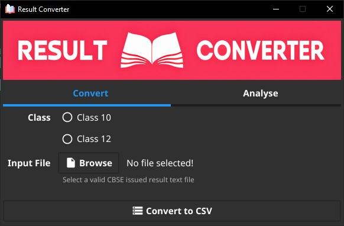
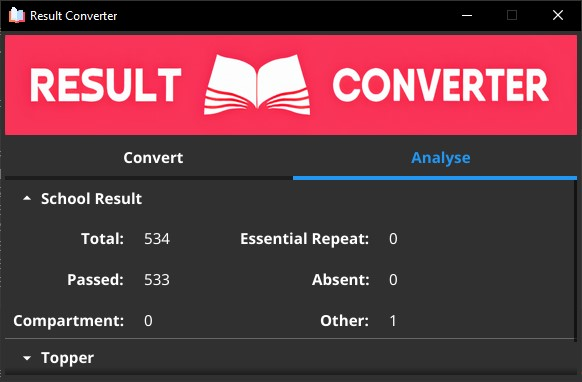

<p align="center">
    
</p>

<p align="center">
    
    
    <a href="https://github.com/luciferchase/CBSE-Result-Converter/releases" title="Total Downloads" rel="nofollow"></a>
    
    
</p>

# Introduction

Every year CBSE releases report of all the students in a school. However, in their infinite wisdom, they are still stuck with the old Newspaper Gazette Style Report in a plain .txt file. Analysis in a plain .txt file is not feasible, hence every year IT dept. of the School spends countless manhours to convert that file to a .csv file.      

This simple app converts that .txt file to .csv file in seconds.

<p align="center">
    
</p>

The .csv file converted through this allows easy analysis and comparision. The output file has these fields:

```python
"ROLL", "GENDER", "NAME",
"SUBJECT CODE 1", "SUBJECT NAME", "MARKS OBTAINED", "GRADE",
"SUBJECT CODE 2", "SUBJECT NAME", "MARKS OBTAINED", "GRADE",
"SUBJECT CODE 3", "SUBJECT NAME", "MARKS OBTAINED", "GRADE",
"SUBJECT CODE 4", "SUBJECT NAME", "MARKS OBTAINED", "GRADE",
"SUBJECT CODE 5", "SUBJECT NAME", "MARKS OBTAINED", "GRADE",
"SUBJECT CODE 6", "SUBJECT NAME", "MARKS OBTAINED", "GRADE",
"TOTAL", "PERCENTAGE", "RESULT",
```

# Analysis

The app provides basic analysis as well, but for detailed anaylsis, use the .csv file.

<p align="center">
    
</p>

# Download

Binaries can be easily download from here [Release](https://github.com/luciferchase/CBSE-Result-Converter/releases).

# Build

Build it from source by cloning this repo and run `setup.sh`. It will build `gui.exe` in the `src/gui` folder (this is a known issue [#2395](https://github.com/fyne-io/fyne/issues/2395)).